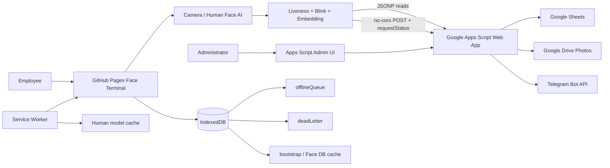
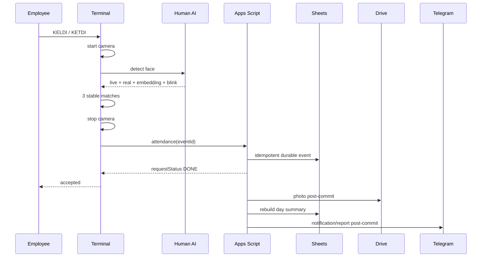

# DAVOMAT — ARCHITECTURE

## Production architecture

## Runtime boundaries

### GitHub Pages terminal

Files:
- `index.html`
- `app.js`
- `styles.css`
- `sw.js`
- `manifest.webmanifest`
- `icon.svg`

Responsibilities:
- camera lifecycle
- face detection
- anti-spoof/liveness
- active blink
- embedding/matching
- local Face DB cache
- offline attendance queue
- user-facing states and errors
- fast local acknowledgement

### Apps Script backend

Files:
- `apps-script/Code.gs`
- `apps-script/Admin.html`
- `apps-script/appsscript.json`

Responsibilities:
- device authentication
- enrollment sessions
- employee/schedule/admin logic
- attendance idempotency
- day summary / payroll v1
- Drive photo storage/retention
- Telegram integration
- audit
- admin sessions

### Google Sheets

Source of record for business data. Exact schema is documented in `DATA_SCHEMA.md`.

### Google Drive

Production photo folder:
- ID `1pLiHLTKCVZN2X0N3AIZ6RORMS2kZE6p0`
- not broadly shared.

### Transport

Reads:
`Terminal -> JSONP GET -> Apps Script`

Writes:
`Terminal -> text/plain no-cors POST -> Apps Script -> requestStatus polling`

This transport is retained because it is compatible with the existing GitHub Pages + Apps Script architecture.

## Attendance transaction

## Cache and update rules

- Service Worker build ID must be unique for every rollout.
- HTML navigation is network-first.
- App shell is versioned.
- Human models have separate cache.
- Face DB cache is invalidated after enrollment.
- Online bootstrap cache max age is 24 hours.
- Offline attendance uses IndexedDB, not localStorage.
